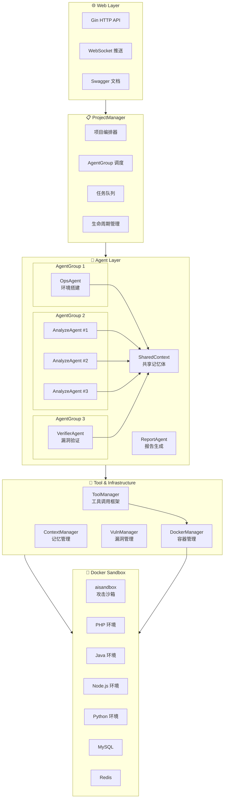
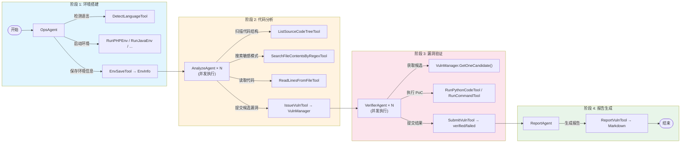
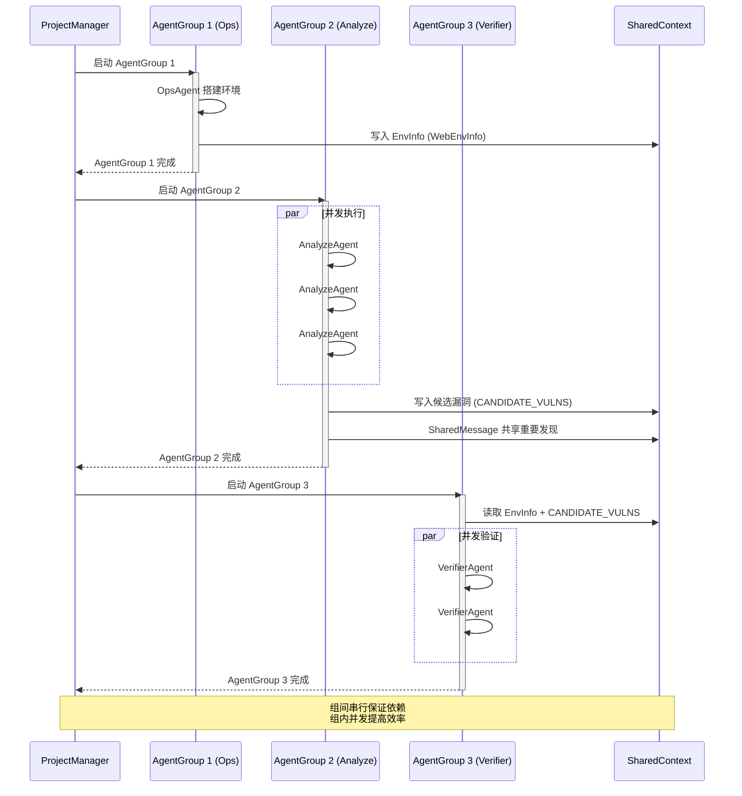

# AIxVuln

AIxVuln 是一个基于大模型（LLM）+ 工具调用（Function Calling）+ Docker 沙箱的**自动化漏洞挖掘与验证系统**。

系统通过 Web API 管理"项目(Project)"，为每个项目自动组织多类 Agent（环境搭建/代码审计/漏洞验证/报告生成），并在隔离的 Docker 环境内完成依赖安装、服务启动、PoC 验证与证据采集，最终产出可下载的报告。

> 🎯 已通过该项目在真实目标中发现**数十个真实漏洞**。

## 核心能力

- **多 Agent 智能协作**：Ops / Analyze / Verifier / Report 四类 Agent 分工协作，通过 SharedContext 共享关键信息
- **Docker 沙箱隔离**：所有代码执行、PoC 验证均在隔离容器中进行，支持 PHP/Java/Node.js/Python/Go 多语言环境
- **端到端自动化**：从源码上传到漏洞报告生成，全流程自动化，无需人工干预
- **实时可观测**：WebSocket 推送实时事件，支持漏洞发现/验证状态跟踪

## 界面预览

系统主界面：


运行中实时漏洞列表（未验证）：


实时产生的漏洞报告（已验证）：


---

## 项目整体架构



### 架构层级说明

| 层级 | 组件 | 职责 |
|------|------|------|
| **Web Layer** | Gin + WebSocket + Swagger | HTTP API、实时事件推送、交互式文档 |
| **ProjectManager** | Orchestrator + AgentGroup | 项目生命周期管理、Agent 分组调度（组间串行、组内并发） |
| **Agent Layer** | Ops/Analyze/Verifier/Report | 各类智能体执行具体任务，通过 SharedContext 共享信息 |
| **Tool & Infrastructure** | ToolManager + DockerManager | 工具调用框架、容器管理、记忆体管理 |
| **Docker Sandbox** | 多语言容器 + 中间件 | 隔离执行环境，源码挂载于 `/sourceCodeDir` |

---

## Agent 工作流程

### 完整漏洞挖掘流程（StartCommonVulnTask）



### AgentGroup 调度机制



### SharedContext 信息共享协议

Agent 之间通过两种机制共享信息：

1. **KeyMessage（关键消息）**：持久化存储，所有 Agent 可读取
   - `WebEnvInfo`: 运行环境信息（端口、地址、登录凭据等）
   - `CANDIDATE_VULNS`: 候选漏洞列表

2. **SharedMessage（共享消息）**：实时广播，Agent 回复末尾添加 `SharedMessage:` 前缀
   - 用于实时共享重要发现、线索、可利用路径等
   - 其他 Agent 在后续推理中可感知并利用

---

## 框架技术介绍

### 核心模块

| 模块 | 职责 | 关键文件 |
|------|------|----------|
| **Web/** | HTTP API + WebSocket 推送 + Swagger 文档 | `Route.go`, `Server.go`, `WebSocket.go` |
| **ProjectManager/** | 项目级编排、AgentGroup 调度、任务队列管理 | `ProjectManager.go`, `Start.go` |
| **agents/** | Agent 接口定义与实现（Ops/Analyze/Verifier/Report） | `base.go`, `AgentCore.go`, `*Agent.go` |
| **llm/** | 记忆体管理（单 Agent / 多 Agent 共享） | `ContextManager.go`, `SharedContext.go` |
| **toolCalling/** | LLM 工具调用框架与工具实现 | `ToolManager.go`, `*Tool.go` |
| **dockerManager/** | Docker 容器操作封装 + ServiceManager | `DockerManager.go`, `service.go` |
| **taskManager/** | Task/Sandbox/VulnManager 等运行时数据结构 | `Task.go`, `Sandbox.go`, `VulnManager.go` |

### 技术选型

| 技术 | 选择 | 原因 |
|------|------|------|
| **语言** | Go 1.24+ | 高并发 goroutine、静态类型安全、单二进制部署 |
| **Web 框架** | Gin | 轻量高性能、中间件生态丰富 |
| **WebSocket** | gorilla/websocket | 成熟稳定的 Go WebSocket 库 |
| **LLM SDK** | sashabaranov/go-openai | OpenAI 风格 API，兼容多厂商模型 |
| **容器** | Docker Engine API | 原生 Go 调用，无需 CLI 依赖 |
| **配置** | INI 格式 | 简单直观，支持多 section |

### 关键设计特性

#### 1. AgentCore 基类模式

所有 Agent 继承 `AgentCore`，复用公共逻辑：

```go
type AgentCore struct {
    Memory            llm.Memory
    Client            *toolCalling.ToolManager
    Task              *taskManager.Task
    PlanManager       *toolCalling.PlanManager       // 规划管理
    CheckpointManager *taskManager.CheckpointManager // 检查点
    PriorityEnforcer  *PriorityEnforcer              // 优先级策略
}

// 子类只需实现 Name() 和 StartTask()
type OpsCommonAgent struct {
    AgentCore // 嵌入基类
}
```

#### 2. Memory 接口抽象

支持两种记忆模式：

```go
type Memory interface {
    AddMessage(x *MessageX)
    GetContext(id string) []openai.ChatCompletionMessage
    AddKeyMessage(x *EnvMessageX)
    SetKeyMessage(env map[string][]interface{}, id string)
    // ...
}

// ContextManager: 单 Agent 独立上下文
// SharedContext:  多 Agent 共享上下文 + SharedMessage 广播
```

#### 3. ToolHandler 接口

统一工具注册与调用：

```go
type ToolHandler interface {
    Name() string
    Description() string
    Parameters() map[string]interface{}
    Execute(args map[string]interface{}) string
}

// 注册示例
agent.RegisterTool(toolCalling.NewRunCommandTool(task))
agent.RegisterTool(toolCalling.NewDockerExecTool(task))
```

---

## 工具分类

### 环境搭建工具

| 工具 | 功能 |
|------|------|
| `DetectLanguageTool` | 检测项目编程语言 |
| `RunPHPEnvTool` | 启动 PHP + Apache 环境 |
| `RunJavaEnvTool` | 启动 Java 多版本 JDK 环境 |
| `RunNodeEnvTool` | 启动 Node.js 环境 |
| `RunPythonEnvTool` | 启动 Python 环境 |
| `RunGolangEnvTool` | 启动 Go 环境 |
| `RunMySQLEnvTool` | 启动 MySQL 数据库 |
| `RunRedisEnvTool` | 启动 Redis 缓存 |
| `EnvSaveTool` | 保存环境信息到记忆体 |

### Docker 容器工具

| 工具 | 功能 |
|------|------|
| `DockerRunTool` | 创建并运行容器 |
| `DockerExecTool` | 在容器内执行命令 |
| `DockerLogsTool` | 获取容器日志 |
| `DockerRemoveTool` | 删除容器 |
| `DockerDirScanTool` | 扫描容器内目录 |
| `DockerFileReadTool` | 读取容器内文件 |

### 代码分析工具

| 工具 | 功能 |
|------|------|
| `ListSourceCodeTreeTool` | 列出源码目录结构 |
| `SearchFileContentsByRegexTool` | 正则搜索文件内容 |
| `ReadLinesFromFileTool` | 读取指定文件行 |

### 漏洞挖掘工具

| 工具 | 功能 |
|------|------|
| `IssueVulnTool` | 提交候选漏洞 |
| `SubmitVulnTool` | 提交验证结果（verified/failed） |
| `ReportVulnTool` | 生成漏洞报告 |

### 执行工具

| 工具 | 功能 |
|------|------|
| `RunCommandTool` | 在沙箱中执行命令 |
| `RunPythonCodeTool` | 执行 Python 代码 |
| `RunPHPCodeTool` | 执行 PHP 代码 |
| `RunSQLTool` | 执行 SQL 语句 |

---

## 配置

配置文件为根目录 `config.ini`。详细配置说明见 [docs/CONFIGURATION.md](docs/CONFIGURATION.md)。

### 基础配置

```ini
[misc]
DATA_DIR = ./data           # 数据目录
MaxRequest = 5              # 全局 LLM API 最大并发
MaxTryCount = 3             # 请求失败最大重试次数

[main_setting]
BASE_URL = https://api.openai.com/v1   # OpenAI 风格 API Base URL
OPENAI_API_KEY = sk-xxx                # API Key（支持 |-| 分隔多个 key 轮询）
MODEL = gpt-4                          # 默认模型名
```

### Agent 模型配置

可按 Agent 类型覆盖模型配置：

```ini
[ops]
MODEL = gpt-4

[analyze]
MODEL = gpt-4

[verifier]
MODEL = gpt-4
```

### 高级配置

```ini
[auth]
USERNAME = admin           # Basic Auth 用户名
PASSWORD = your_password   # Basic Auth 密码

[log]
LOG_LEVEL = info           # 日志级别 (debug/info/warn/error)
LOG_FORMAT = console       # 输出格式 (console/json)

[cache]
ENABLE_CACHE = true        # 是否启用 LLM 缓存
CACHE_TTL = 3600           # 缓存过期时间（秒）
CACHE_MAX_SIZE = 1000      # 最大缓存条目数

[optimization]
EnablePlanning = false             # 启用规划功能
EnableCheckpoint = false           # 启用检查点功能
EnablePriorityEnforcement = false  # 启用优先级策略
EnableTieredMemory = false         # 启用分层记忆
```

---

## Docker 镜像

### aisandbox（攻击沙箱）

提供常用安全测试工具与运行时依赖，用于 PoC 验证和攻击脚本执行。

```bash
docker build -t aisandbox -f dockerfile/dockerfile.aisandbox/Dockerfile dockerfile/dockerfile.aisandbox
```

### java_env（Java 环境）

提供 Java 多版本 JDK 与常用构建工具（Maven、Gradle）。

```bash
docker build -t java_env -f dockerfile/dockerfile.java_env/Dockerfile dockerfile/dockerfile.java_env
```

---

## 目录结构

```text
.
├── main.go                 # 程序入口
├── config.ini              # 配置文件
├── Web/                    # HTTP API + WebSocket 推送
│   ├── Route.go            # 路由定义
│   ├── Server.go           # 服务器启动
│   └── WebSocket.go        # WebSocket 处理
├── ProjectManager/         # 项目级编排、并发与生命周期管理
│   ├── ProjectManager.go   # 核心管理器
│   └── Start.go            # 任务启动流程定义
├── agents/                 # Agent 实现
│   ├── base.go             # Agent 接口定义
│   ├── AgentCore.go        # Agent 基类
│   ├── OpsCommonAgent.go   # 环境搭建 Agent
│   ├── AnalyzeCommonAgent.go   # 代码分析 Agent
│   ├── VerifierCommonAgent.go  # 漏洞验证 Agent
│   └── ReportCommonAgent.go    # 报告生成 Agent
├── taskManager/            # Task/Sandbox/VulnManager 等
│   ├── Task.go             # 任务结构
│   ├── Sandbox.go          # 沙箱管理
│   └── VulnManager.go      # 漏洞管理
├── toolCalling/            # LLM Tool 调用与工具实现
│   ├── ToolManager.go      # 工具管理器
│   └── *Tool.go            # 各类工具实现
├── dockerManager/          # Docker 操作封装 + ServiceManager
│   ├── DockerManager.go    # Docker API 封装
│   └── service.go          # 语言环境服务
├── llm/                    # 上下文与共享记忆体
│   ├── ContextManager.go   # 单 Agent 上下文
│   └── SharedContext.go    # 多 Agent 共享上下文
├── misc/                   # 配置/工具函数/任务模板
├── dockerfile/             # 镜像构建目录
│   ├── dockerfile.aisandbox/
│   └── dockerfile.java_env/
└── data/                   # 运行时数据
    └── projects/           # 项目数据
```

---

## 快速开始

### 前置条件

- **Go 1.24+**（与 `go.mod` 保持一致）
- **Docker** 已安装并启动
- 已构建依赖的 Docker 镜像：`aisandbox`、`java_env`

### 1. 构建 Docker 镜像

```bash
docker build -t aisandbox -f dockerfile/dockerfile.aisandbox/Dockerfile dockerfile/dockerfile.aisandbox
docker build -t java_env -f dockerfile/dockerfile.java_env/Dockerfile dockerfile/dockerfile.java_env
```

### 2. 配置

复制并编辑配置文件：

```bash
cp config.ini.example config.ini
# 编辑 config.ini，填入你的 API Key 等配置
```

### 3. 运行

```bash
go run .
```

默认监听：`0.0.0.0:9999`

### 4. 访问 API 文档

启动后访问 Swagger UI 查看交互式 API 文档：

```
http://localhost:9999/swagger/index.html
```

### 5. 前端 UI（可选）

本仓库不提供前端 UI。如需可视化交互，请启动前端仓库：

```
https://github.com/qqliushiyu/AIxVuln_Web
```

### 6. 运行（二进制）

你也可以直接从 GitHub Releases 下载已编译的二进制文件运行。

---

## API 端点

### 项目管理

| 方法 | 端点 | 说明 |
|------|------|------|
| `POST` | `/projects/create?projectName=xxx` | 上传源代码压缩包创建项目 |
| `GET` | `/projects/:name/start?startType=0\|1\|2` | 启动项目（0=完整流程, 1=仅分析, 2=决策驱动） |
| `GET` | `/projects/:name/cancel` | 取消运行中的任务 |
| `GET` | `/projects/:name` | 获取项目详情（状态、漏洞、容器、事件） |
| `GET` | `/projects/:name/del` | 删除项目 |

### 漏洞与报告

| 方法 | 端点 | 说明 |
|------|------|------|
| `GET` | `/projects/:name/vulns` | 获取漏洞列表 |
| `GET` | `/projects/:name/reports` | 获取报告列表 |
| `GET` | `/projects/:name/reports/download/:id` | 下载单个报告 |
| `GET` | `/projects/:name/reports/downloadAll` | 下载所有报告（ZIP） |

### 实时通信

| 方法 | 端点 | 说明 |
|------|------|------|
| `GET` | `/ws` | WebSocket 连接，接收实时事件 |

**认证**：Basic Auth（默认 `admin:ss0t@m4x`，可在配置文件中修改）

---

## 扩展指南

### 新增工具

1. 在 `toolCalling/` 中创建 `YourTool.go`，实现 `ToolHandler` 接口
2. 在相关 Agent 构造函数中注册：`agent.RegisterTool(toolCalling.NewYourTool(task))`

### 新增 Agent

1. 在 `agents/` 中创建 `YourAgent.go`，嵌入 `AgentCore` 并实现 `Agent` 接口
2. 在 `ProjectManager/Start.go` 中添加到相应的 AgentGroup

### 新增运行环境

1. 在 `dockerManager/service.go` 中添加 `StartXxxEnv()` 方法
2. 创建对应工具 `toolCalling/RunXxxEnvTool.go`
3. 在 OpsAgent 中注册该工具

---

## 注意事项

- ⚠️ 本项目会启动并控制 Docker 容器，请在**隔离环境**中使用
- ⚠️ 配置文件中包含 API Key 等敏感信息，建议使用 `.gitignore` 管理或改用环境变量
- ⚠️ 默认认证凭据仅供开发测试，生产环境请务必修改

---

## License

MIT License
