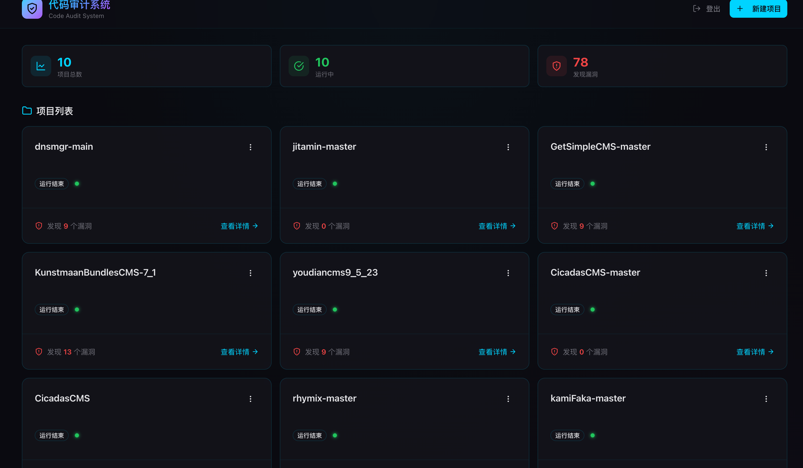
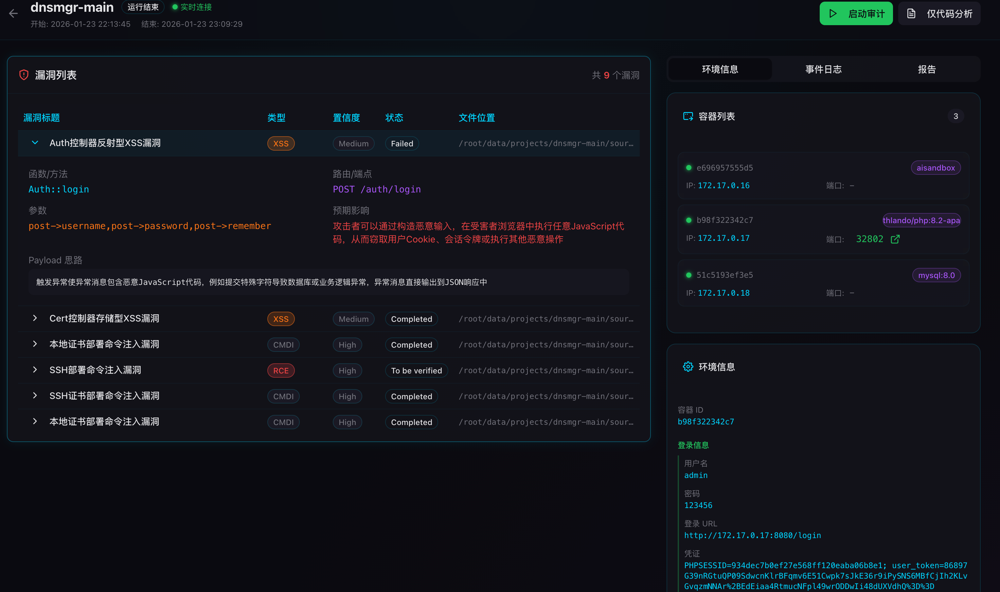
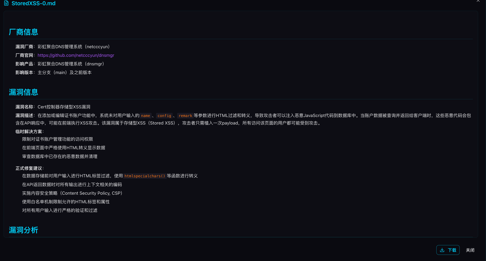

这是一个使用 [`create-next-app`](https://nextjs.org/docs/app/api-reference/cli/create-next-app) 引导创建的 [Next.js](https://nextjs.org) 项目。

## 快速开始

首先，运行开发服务器：

```bash
npm run dev
# 或者
yarn dev
# 或者
pnpm dev
# 或者
bun dev
```
```bash
cd code-audit-system
cp .env.local.example .env.local  # 配置后端 API 地址
npm run dev
```
```bash
code-audit-system/
├── src/
│   ├── app/
│   │   ├── globals.css         # 科技风格主题 + 动画
│   │   ├── layout.tsx          # 根布局 + Sonner toast
│   │   ├── page.tsx            # 项目列表页
│   │   └── projects/[name]/
│   │       └── page.tsx        # 项目详情页
│   ├── components/
│   │   ├── audit/              # 业务组件
│   │   │   ├── StatusBadge.tsx     # 状态标签
│   │   │   ├── ProjectCard.tsx     # 项目卡片
│   │   │   ├── VulnTable.tsx       # 漏洞表格（可展开详情）
│   │   │   ├── ContainerList.tsx   # 容器列表
│   │   │   ├── EventLog.tsx        # 事件日志（终端风格）
│   │   │   ├── ReportList.tsx      # 报告下载列表
│   │   │   ├── EnvInfoPanel.tsx    # 环境信息面板
│   │   │   └── UploadDialog.tsx    # 上传源码弹窗
│   │   └── ui/                 # shadcn 组件
│   ├── hooks/
│   │   └── useWebSocket.ts     # WebSocket 连接管理（自动重连）
│   └── lib/
│       ├── api.ts              # API 服务层
│       └── types.ts            # TypeScript 类型定义
└── .env.local.example          # 环境变量示例
```

在浏览器中打开 [http://localhost:3000](http://localhost:3000) 查看结果。

你可以通过修改 `app/page.tsx` 来编辑页面。编辑文件时页面会自动更新。

本项目使用 [`next/font`](https://nextjs.org/docs/app/building-your-application/optimizing/fonts) 自动优化并加载 [Geist](https://vercel.com/font)，这是 Vercel 推出的新字体系列。

## Agent后端仓库

```html
https://github.com/m4xxxxx/AIxVuln
```

## 截图







## 了解更多

要了解更多关于 Next.js 的信息，请查看以下资源：

- [Next.js 文档](https://nextjs.org/docs) - 了解 Next.js 的功能和 API。
- [学习 Next.js](https://nextjs.org/learn) - 交互式 Next.js 教程。

你可以查看 [Next.js GitHub 仓库](https://github.com/vercel/next.js) - 欢迎提供反馈和贡献！

## 在 Vercel 上部署

部署 Next.js 应用最简单的方式是使用 Next.js 创建者推出的 [Vercel 平台](https://vercel.com/new?utm_medium=default-template&filter=next.js&utm_source=create-next-app&utm_campaign=create-next-app-readme)。

查看我们的 [Next.js 部署文档](https://nextjs.org/docs/app/building-your-application/deploying) 了解更多详情。
